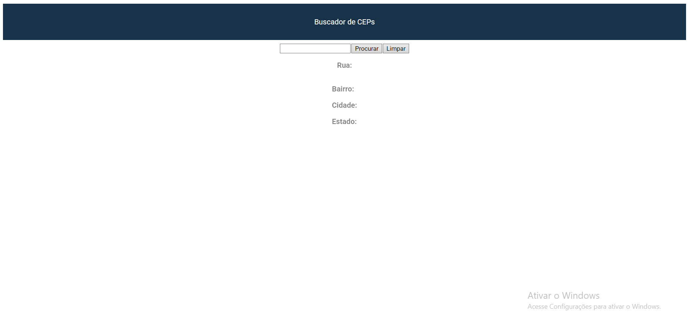

# Projeto buscador de Ceps

O objetivo do projeto é pesquisar CEPs em uma api chamada https://viacep.com.br

## Design do projeto

## API utilizanda
A api https://viacep.com.br retorna as seguintews informações para um cep de exemplo 62823000:
```
//https://viacep.com.br/ws/62823000/json/

{
  "cep": "62823-000",
  "logradouro": "",
  "complemento": "",
  "unidade": "",
  "bairro": "",
  "localidade": "Jaguaruana",
  "uf": "CE",
  "estado": "Ceará",
  "regiao": "Nordeste",
  "ibge": "2307007",
  "gia": "",
  "ddd": "88",
  "siafi": "1441"
}
```

## Funcionalidades
- [x] Busca do CEP
- [x] limpar dados
- [ ] Rodapé
- [ ] Melhorado o Design
- [ ] Responaividade


### Observações
> [!NOTE]
> Projeto feito na disciplina de programaçã web  I no curso de analiise e desenvolvimento de sistemas.

> [!IMPORTANT]
> Alguns ceps podem não conter todas as informações.

## Contatos

Email: edberkze@gmail.com